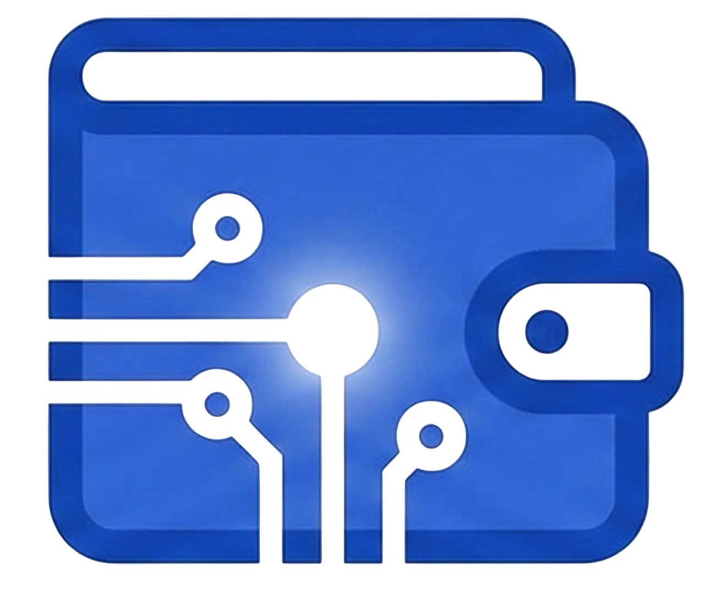

# 💰 DigiKas - Aplikasi Uang Kas Digital



<div align="center">


</div>

---

## 📖 Tentang Proyek

**DigiKas** adalah aplikasi berbasis web (Progressive Web App / PWA) yang dirancang untuk mempermudah pengelolaan uang kas angkatan/kelas mahasiswa. Aplikasi ini menawarkan transparansi keuangan, kemudahan pembayaran iuran, dan pengelolaan data yang efisien antara Admin dan Mahasiswa.

> **Context:** Dibuat sebagai Tugas Akhir Praktikum PPB (Pemrograman Perangkat Bergerak).

---

## 🚀 Fitur Utama

### 👨‍💼 Role: Admin
- **Dashboard Statistik:** Grafik visual (Recharts) untuk pemasukan vs pengeluaran bulanan dan ringkasan saldo total.
- **Manajemen Mahasiswa:** CRUD (Create, Read, Update, Delete) data anggota angkatan.
- **Manajemen Transaksi:**
  - Input manual untuk Pemasukan & Pengeluaran Kas.
  - **Validasi Saldo Otomatis:** Sistem menolak input pengeluaran jika saldo kas tidak mencukupi.
- **Verifikasi Setoran:** Menerima atau menolak bukti transfer dari mahasiswa dengan fitur alasan penolakan.
- **Laporan Lengkap:** Tabel riwayat transaksi dengan fitur filter (Tipe/Status) dan pencarian nama.

### 🎓 Role: Mahasiswa
- **Dashboard Personal:** Memantau kontribusi setoran pribadi dibandingkan dengan total kas angkatan.
- **Bayar Kas Online:** Upload bukti transfer atau nota pembayaran dengan mudah.
- **Riwayat Transaksi:**
  - **Tab Personal:** Melihat status pembayaran sendiri (*Pending/Verified/Rejected*).
  - **Tab Transparansi:** Melihat arus kas global angkatan (Pemasukan & Pengeluaran) untuk transparansi.
- **Profil Pengguna:** Melihat informasi detail akun.

---

## 🛠️ Teknologi (Tech Stack)

| Kategori | Teknologi | Deskripsi |
| :--- | :--- | :--- |
| **Framework** | [Next.js 15](https://nextjs.org/) | App Router Architecture |
| **Language** | TypeScript | Static Typing |
| **Styling** | Tailwind CSS | Utility-first CSS framework |
| **Database** | [Supabase](https://supabase.com/) | PostgreSQL & Storage |
| **PWA** | `next-pwa` | Offline capability & Installable |
| **Visualization** | Recharts | Grafik data statistik |
| **UI Components** | Lucide React | Icons |
| **UX Feedback** | Sonner | Toast Notifications |
| **Documentation** | Swagger UI | API Documentation |

---

## ⚙️ Instalasi & Setup Lokal

Ikuti langkah-langkah ini untuk menjalankan proyek di komputer lokal Anda.

### 1. Clone Repository

```bash
git clone [https://github.com/username-anda/uang-kas-digital.git](https://github.com/username-anda/uang-kas-digital.git)
cd uang-kas-digital
